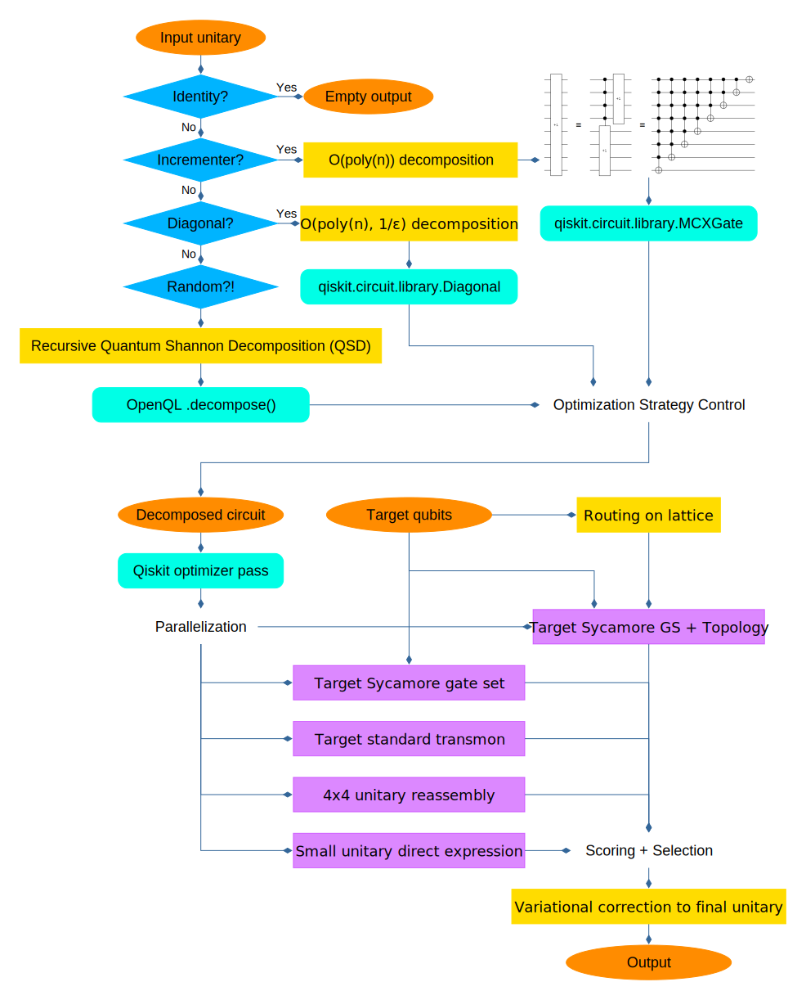

# The Q.U.A.C.K. Transpiler for Google Sycamore

Allen Mi - Apr. 11, 2021

*Winner - QCHack 2021 Google Challenge*

## Dependencies

```python
cirq==0.11.0.dev20210321221345
pytest
pytest-watch

qutechopenql==0.8.1.dev4
qiskit==0.25.0
joblib==1.0.1
```

## File Structure

- `solution.py`: interface, matrix classification

- `transpiler.py`: main transpiler code

- `utils.py`: utility code

## Flow Chart


